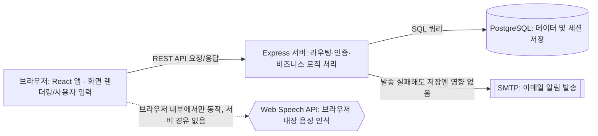
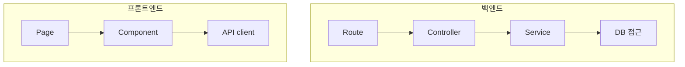

# 기술 아키텍처 다이어그램 — 정성을 보여줘

`4-project-principle.md`에 정의된 구조 원칙을 시스템 구성과 레이어 의존 관계 두 가지 관점으로 시각화한 문서다.

## 1. 시스템 아키텍처

Web Speech API는 점선 화살표로 표시했다 — 서버를 거치지 않고 브라우저 안에서만 동작하는 기능임을 나타낸다.

## 2. 레이어 의존 흐름

백엔드와 프론트엔드 각각 레이어 이름과 단방향 화살표만 표시했다 — 각 레이어의 파일 목록은 원칙 문서를 참고한다.

