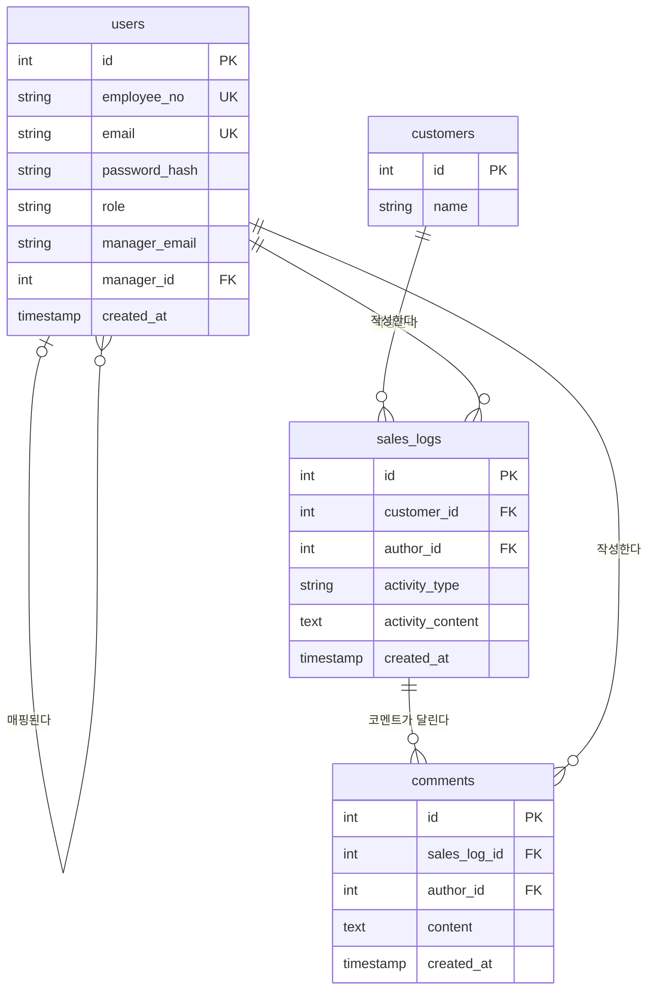

# 정성을 보여줘 — ERD (MVP)

이 문서는 B2B 영업일지 MVP의 PostgreSQL 4개 테이블(`users`, `customers`, `sales_logs`, `comments`)에 대한 ERD와 그 근거를 정리한다. 컬럼명은 `4-project-principle.md`의 "도메인 용어 ↔ 코드 네이밍 매핑표"를 그대로 따르고, 매핑표에 없는 컬럼은 도메인 정의서/PRD의 RULE-ID를 근거로 최소한만 추가했다.

## users

| 컬럼 | 제약 | 근거 |
|---|---|---|
| id | PK | - |
| employee_no | UK, NOT NULL, 6자리 고정 | RULE-AUTH-001(6자리), RULE-AUTH-004(중복 불가) |
| email | UK, NOT NULL | RULE-AUTH-002(이메일 형식), RULE-AUTH-005(중복 불가) |
| password_hash | NOT NULL | RULE-AUTH-003(비밀번호 7자리 이상) + 원칙문서 5번 보안 섹션(bcrypt 해시 저장, 평문 저장 금지, PRD 6번) — 원문은 저장하지 않으므로 컬럼명을 `password`가 아닌 `password_hash`로 확정 |
| role | NOT NULL, CHECK/ENUM('salesperson','manager') | RULE-AUTH-006, RULE-USER-001~002 |
| manager_email | nullable (영업사원은 사실상 NOT NULL, 팀장은 NULL) | RULE-ORG-001(영업사원 필수 입력), RULE-ORG-002(이메일 형식), RULE-ORG-006(팀장은 미입력) |
| manager_id | FK → `users.id`, nullable, 자기참조 | RULE-ORG-003(매칭 전 NULL), RULE-ORG-005(팀장이 실제 가입하면 백필), RULE-ORG-007(영업사원은 정확히 하나의 팀장에게만 매핑 — 단일 컬럼이라 자동 보장) |
| created_at | NOT NULL, 자동 기록 | 감사용 표준 컬럼 (작업 지시에 예시로 명시된 항목) |

## customers

| 컬럼 | 제약 | 근거 |
|---|---|---|
| id | PK | - |
| name | NOT NULL | 도메인 정의서 6.1 "영업활동의 대상이 되는 고객 또는 사업체" — RULE-CUSTOMER-003(관리자 화면 없이 DB 직접 등록)이므로 스키마도 최소 구성. 주소/업종/담당자 등은 어떤 근거 문서에도 없어 추가하지 않음 |

## sales_logs

| 컬럼 | 제약 | 근거 |
|---|---|---|
| id | PK | - |
| customer_id | FK → `customers.id`, NOT NULL | RULE-CUSTOMER-001(사전 등록된 거래처 중 선택) |
| author_id | FK → `users.id`, NOT NULL | RULE-LOG-002(작성자 본인만 수정), RULE-LOG-003(작성자 본인만 삭제) — 작성자 식별 필수 |
| activity_type | NOT NULL, CHECK/ENUM('외근','내근','기타') | 도메인 정의서 7.3 |
| activity_content | NOT NULL, text | 도메인 정의서 7.2(필수 입력), PRINCIPLE-ACTIVITY-001 |
| created_at | NOT NULL, 자동 기록, 수정 불가 | RULE-LOG-001(작성일 임의 변경 불가), RULE-LOG-004(수정해도 최초 작성일 불변) |

- **상태(작성완료/코멘트진행중) 컬럼은 두지 않는다** — 원칙문서 1번 섹션 "파생 가능한 값은 저장하지 않는다"에 따라 `comments` 존재 여부로 매 조회 시 계산한다(PRD 5.11, 도메인 정의서 16번).
- **`updated_at` 컬럼도 두지 않는다** — 도메인 정의서 7.4절이 "추후 필요하면 최초 작성일과 최종 수정일을 별도로 관리한다"고 명시적으로 유보한 항목이라 MVP 스키마에서는 제외한다.

## comments

| 컬럼 | 제약 | 근거 |
|---|---|---|
| id | PK | - |
| sales_log_id | FK → `sales_logs.id`, NOT NULL | RULE-FEEDBACK-001(하나의 영업일지에 여러 코멘트, 횟수 제한 없음), RULE-REPLY-003(답변은 해당 영업일지·스레드와 연결) |
| author_id | FK → `users.id`, NOT NULL | RULE-FEEDBACK-003(해당 영업사원의 팀장만 코멘트 작성), RULE-REPLY-002(해당 영업일지 작성자 본인만 답변) |
| content | NOT NULL, text | 코멘트/답변 본문 |
| created_at | NOT NULL, 자동 기록 | RULE-FEEDBACK-002/RULE-REPLY-001(최초 코멘트는 팀장부터 시작해야 한다는 순서 판별에 필요) |

- **`comment_type`("feedback"/"reply") 컬럼은 두지 않는다** — 원칙문서가 "`author_id` → `users.role`로 판별"한다고 명시했으므로, 코멘트 작성자가 팀장인지 영업사원인지는 JOIN으로 판별하고 별도 컬럼을 두지 않는다.

## 관계 요약

| 관계 | 카디널리티 | FK | 근거 |
|---|---|---|---|
| `users`(팀장) — `users`(영업사원) | 팀장 0..1 : 영업사원 0..N | `users.manager_id` → `users.id` | RULE-ORG-007(영업사원은 정확히 하나의 팀장에게만 매핑), RULE-ORG-003/005(매칭 전 NULL, 매칭 후 채워짐 — optional 관계) |
| `customers` — `sales_logs` | 거래처 1 : 영업일지 0..N | `sales_logs.customer_id` → `customers.id` | RULE-CUSTOMER-001 |
| `users`(작성자) — `sales_logs` | 사용자 1 : 영업일지 0..N | `sales_logs.author_id` → `users.id` | RULE-LOG-002~003(작성자만 수정/삭제) |
| `sales_logs` — `comments` | 영업일지 1 : 코멘트 0..N | `comments.sales_log_id` → `sales_logs.id` | RULE-FEEDBACK-001(횟수 제한 없음) |
| `users`(코멘트 작성자) — `comments` | 사용자 1 : 코멘트 0..N | `comments.author_id` → `users.id` | RULE-FEEDBACK-003, RULE-REPLY-002 |

## 참고

`connect-pg-simple`이 자동 생성하는 세션 테이블은 도메인 엔티티가 아니므로 ERD에서 관계선으로 연결하지 않고 제외했다 — 세션 테이블은 별도 라이브러리가 관리하는 대상이다(`7-schema.sql` 하단 참고 — 해당 파일에도 세션 테이블 DDL은 포함하지 않는다고 명시되어 있다).
